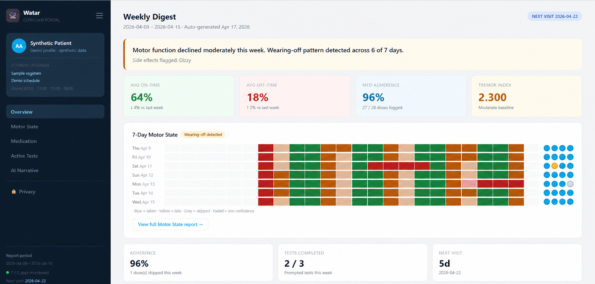
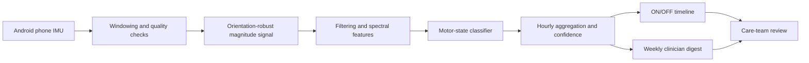

# NeuroSense: smartphone-based Parkinson's monitoring

> A team design study for translating phone inertial-sensor data into an interpretable motor-state timeline and a concise clinician-facing digest.

_An anonymized reconstruction of the project dashboard. Values are illustrative prototype data, not clinical results._

## Project snapshot

| Dimension | Description |
|---|---|
| Domain | Digital health, Parkinson's disease, mobile sensing |
| Modality | Smartphone accelerometer and gyroscope (IMU) |
| Primary question | Can passive phone sensing help summarize medication ON/OFF patterns between neurology visits? |
| Intended users | Patient/caregiver, visiting nurse, and treating neurologist |
| Public stage | Team concept, signal-processing plan, product requirements, and dashboard prototype |
| Validation status | Not clinically validated; no diagnostic claim |
| Public boundary | No participant data, serialized metadata, model weights, meeting transcript, or downloaded papers |

The source archive used two working names: **NeuroSense** in the concept note and product requirements, and **Watar** in the interface and pitch prototype. This case study uses NeuroSense as the descriptive project name while preserving that provenance.

## Why the problem matters

Parkinson's motor symptoms fluctuate between short clinic visits. A design that uses the phone a patient already owns could make longitudinal monitoring more accessible than a wearable-only workflow, especially when a caregiver helps with setup and optional active tests.

The project therefore focused on a bounded question: how might phone IMU signals be converted into an interpretable timeline for clinical discussion without presenting the system as a diagnostic device or an autonomous treatment recommender?

## Proposed system

The classifier plan begins with five-second, three-axis windows sampled at 100 Hz in the research dataset. It collapses axes into signal magnitude, removes the gravity component with a high-pass filter, calculates a power spectral density, and extracts interpretable tremor features. The product concept proposes adapting this pipeline for continuous Android sensing and on-device inference.

## Interpretable baseline

The initial classifier was deliberately specified as a transparent baseline before a more complex learned model.

| Signal property | Proposed measurement | Intended interpretation |
|---|---|---|
| Tremor power | PSD energy in the 4-6 Hz band | Intensity of rhythmic tremor-like activity |
| Dominant frequency | Peak frequency within 3-7 Hz | Whether the strongest component falls near the target band |
| Regularity | Peak-to-mean power ratio in 3-7 Hz | Sharp, sustained rhythm versus diffuse motion energy |
| Data coverage | Valid windows observed per hour | Whether an hourly label is sufficiently supported |

Thresholds were planned from percentiles of Parkinson's-disease windows rather than arbitrary constants: low, mid, and high tremor-power cutoffs plus a median regularity cutoff. Hourly labels would be accompanied by coverage and confidence rather than shown as equally reliable.

## Research and engineering decisions

- **Signal quality before classification.** No-data and low-confidence periods remain visible instead of being silently imputed.
- **Explainable first baseline.** Frequency-domain features and percentile thresholds make early behavior inspectable.
- **Caregiver-centered interaction.** Passive monitoring is primary; active finger-tapping, spiral drawing, gait, or sustained-hold tasks are optional and assisted.
- **Privacy boundary.** The concept favors on-device processing and feature-level summaries instead of raw-sensor uploads.
- **Clinical discussion support.** The dashboard communicates trends and questions for review; it does not prescribe a medication change.

## Prototype outputs

The design materials specify three output layers:

1. A seven-day motor-state timeline with ON, transitional, OFF, no-data, and confidence states.
2. Medication-response and active-test views that place trends in temporal context.
3. A short AI-assisted narrative built from de-identified structured summaries, clearly labeled as discussion support rather than clinical advice.

The dashboard image above is included to document interaction and information design. It is not evidence that the proposed classifier achieved the displayed values.

## Evaluation plan

| Stage | Question | Proposed evidence |
|---|---|---|
| Face-validity check | Do higher clinical tremor scores align with more moderate/severe windows? | Subject-level comparison against available UPDRS fields |
| Technical validation | Does performance generalize across people? | Patient-held-out evaluation with leakage-resistant splits |
| Robustness | How do phone placement and motion artifacts affect predictions? | Quality masks, placement-aware analysis, and coverage reporting |
| Clinical pilot | Does the digest add useful information between visits? | Prospective study with neurologist review and prespecified endpoints |

No prospective clinical results are claimed in the archived materials. Any future clinical study would require ethics review, appropriate consent, a locked protocol, and evaluation beyond a hackathon dataset.

## Evidence map

The local archive contained downloaded literature, but those PDFs are intentionally not redistributed. Useful public entry points recorded by the project include:

- Albert et al., *Using Mobile Phones for Activity Recognition in Parkinson's Patients*, Frontiers in Neurology (2012), [doi:10.3389/fneur.2012.00158](https://doi.org/10.3389/fneur.2012.00158).
- [mPower Mobile Parkinson Disease Study](https://dhealth.synapse.org/Explore/Collections/DetailsPage?study=mPower%20Mobile%20Parkinson%20Disease%20Study).
- [ClinicalTrials.gov NCT02474329](https://clinicaltrials.gov/study/NCT02474329?tab=results).
- [Zenodo record 15769959](https://zenodo.org/records/15769959).

These sources motivate feasibility and study design. Their source-reported results are not presented as NeuroSense performance.

## Public release boundary

### Included

- This original technical case-study synthesis
- One anonymized prototype figure
- Architecture, classifier rationale, evaluation plan, and limitations
- Links to public data/study entry points

### Excluded

- `subject_metadata.pickle` and any participant-level sensor data
- Model files, checkpoints, and serialized objects
- Downloaded research-paper PDFs
- Private meeting transcript and internal working documents
- Unverified clinical claims and illustrative dashboard metrics as results

## Collaboration and authorship

This was a **Team Beirut 332** collaborative hackathon concept. The archived concept note lists Jean Marc Achkar, Tamara Sadek, Ahmed Najia, Jad Daorah, and Abdulrahman Kobaissi. Because the archive does not assign individual authorship for every component, this case study describes the collective work and does not attribute unverified elements to one person.

## Current conclusion

NeuroSense is best represented as a thoughtful digital-health design and signal-processing study, not as a finished medical product. Its strongest contribution is the translation of a clinical monitoring gap into an interpretable sensing pipeline, an explicit privacy boundary, and a staged validation plan.
